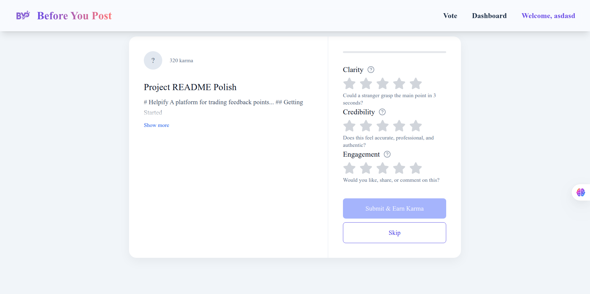
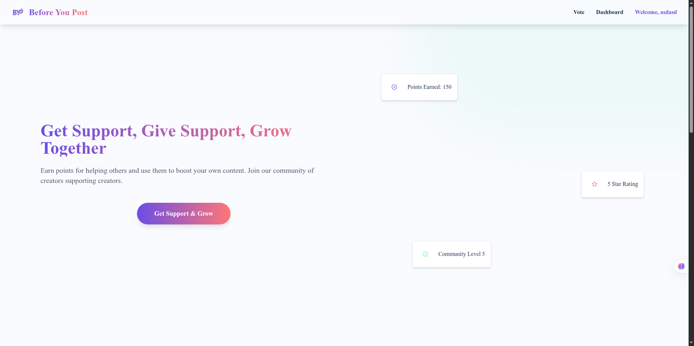

# BeforeYouPost

[beforeyoupost.net](https://beforeyoupost.net/) · Give and get feedback **before** you publish. Draft smarter posts for X/Twitter, LinkedIn, Reddit, and more.

<p align="left">
  <a href="https://beforeyoupost.net/">
    
  </a>
  <a href="#-contributing">
    
  </a>
  <a href="#-license">
    
  </a>
</p>

A modern **Next.js (App Router + TypeScript)** app to crowd‑review your post drafts, score them, and collect actionable suggestions—so you only ship your best takes.

---

## ✨ Features

* 📝 **Draft preview** with rich text & image support
* ⭐ **Feedback & ratings** (concise + detailed suggestions)
* 🗳️ **Vote / sort** by Most Helpful, New, or Critical
* 🔐 **Privacy modes:** private link, unlisted, or public
* 🏷️ **Categories & tags** (e.g., X, LinkedIn, Reddit)
* 🏁 **Ready-to-post export** (copy formats, hashtags, mentions)
* 📊 **Simple analytics** (views, feedback rate, avg. score)

> Roadmap ideas: AI rewrite suggestions, tone checker, scheduling helpers, team spaces.

---

## 🧱 Tech Stack

* **Framework:** Next.js 14+ (App Router), React, TypeScript
* **Styling:** Tailwind CSS
* **Auth (optional):** NextAuth.js
* **Deploy:** Amplify

---

## 🚀 Quick Start

```bash
# 1) Install
pnpm install # or npm/yarn/bun

# 2) Env vars
cp .env.example .env.local
# fill values (see table below)

# 3) Dev
pnpm dev
# http://localhost:3000

# 4) Lint & typecheck
pnpm lint && pnpm typecheck

# 5) Build
pnpm build && pnpm start
```
---
## 📸 Screenshots

Add a couple of PNGs under `public/` and reference them here:

```


```
---

## 🤝 Contributing

* Use **feature branches** and **conventional commits** (`feat:`, `fix:`, `chore:`)
* Run `pnpm lint && pnpm typecheck` before opening a PR
* Small, focused PRs get merged faster

See **CONTRIBUTING.md** below for details.

---

## 🛡️ Security

Found a vulnerability? Please see **SECURITY.md** below to report it responsibly.

---

## 📜 License

MIT © 2025 Abdallah Bahrawi

---

## 📬 Contact

* Site: **[beforeyoupost.net](https://beforeyoupost.net/)**
* X/Twitter: *https://x.com/Abdallahbahraw1*
* Email: *abdallah.bahrawi400@gmail.com*

---

## `.github/PULL_REQUEST_TEMPLATE.md`

```markdown
## Summary

- What does this PR do?

## Changes

- [ ] Feature
- [ ] Fix
- [ ] Chore

## Screenshots / Demos

(If UI changes)

## Checklist
- [ ] Linted and typechecked
- [ ] Self‑reviewed
- [ ] Added tests or not needed
```

## `.github/ISSUE_TEMPLATE/bug_report.yml`

```yaml
name: Bug report
labels: [bug]
description: File a bug
body:
  - type: textarea
    id: what-happened
    attributes:
      label: What happened?
      description: Also tell us what you expected to happen.
    validations:
      required: true
  - type: input
    id: url
    attributes:
      label: Link (if public)
  - type: textarea
    id: steps
    attributes:
      label: Steps to reproduce
  - type: textarea
    id: env
    attributes:
      label: Environment
      description: OS, Browser, etc.
```

## `.github/ISSUE_TEMPLATE/feature_request.yml`

```yaml
name: Feature request
labels: [enhancement]
description: Suggest an idea
body:
  - type: textarea
    id: problem
    attributes:
      label: Problem
  - type: textarea
    id: solution
    attributes:
      label: Proposed solution
  - type: textarea
    id: extras
    attributes:
      label: Alternatives / context
```

## `CONTRIBUTING.md`

```markdown
# Contributing

Thanks for considering a contribution! Please:

1. Fork and create a feature branch.
2. Use conventional commits (e.g., `feat:`, `fix:`).
3. Run `pnpm lint && pnpm typecheck` before pushing.
4. Open a PR with a clear description and screenshots (if UI).

Small PRs merge faster 💚
```